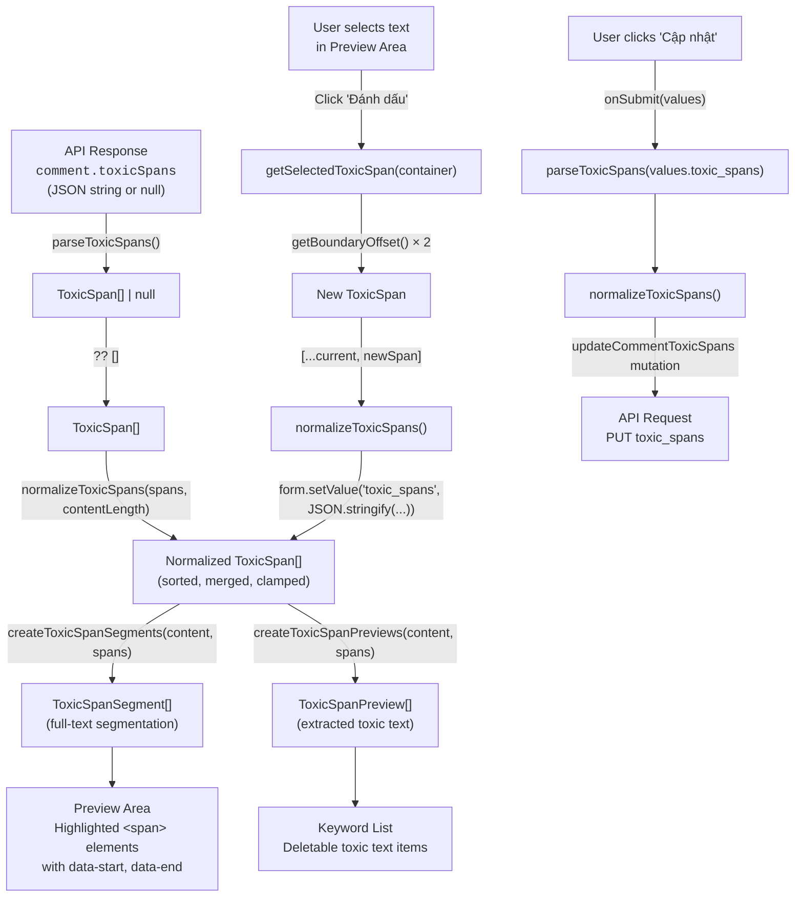

# Comment Toxic Spans — Utility Functions Reference

> **Source file:** [`text.util.ts`](D:/CODE/Web/KTLN/movie/cms/src/utils/text.util.ts)
> **Types:** [`comment.type.ts`](D:/CODE/Web/KTLN/movie/cms/src/types/comment.type.ts)
> **Consumer:** [`comment-toxic-spans-modal.tsx`](D:/CODE/Web/KTLN/movie/cms/src/app/movie/%5Bid%5D/comment/_components/comment-toxic-spans-modal.tsx)

---

## Types

```ts
// A half-open character range [start, end) within the comment text.
type ToxicSpan = {
  start: number; // inclusive start offset
  end: number; // exclusive end offset
};

// A ToxicSpan enriched with the actual substring it covers.
type ToxicSpanPreview = ToxicSpan & {
  text: string;
};

// A contiguous segment of the comment text, either toxic or clean.
type ToxicSpanSegment = {
  start: number; // inclusive start offset
  end: number; // exclusive end offset
  text: string; // the substring content.slice(start, end)
  toxic: boolean; // true if this segment is inside a toxic span
};
```

---

## 1. `parseToxicSpans`

```ts
parseToxicSpans(value: string | null | undefined): ToxicSpan[] | null
```

**Purpose:** Safely deserializes a JSON string into a validated array of `ToxicSpan` objects. This is the first function called when reading toxic span data from the API response (`comment.toxicSpans`), which arrives as a raw JSON string or `null`.

**Algorithm:**

1. **Nullish/empty guard:** If `value` is `null`, `undefined`, or an empty string, returns `[]` (empty array — no spans).
2. **JSON parse:** Calls `JSON.parse(value)`.
3. **Array check:** If the parsed result is not an array, returns `null` (signals corrupt data).
4. **Element validation:** Iterates over each element and verifies:
   - The element is a non-null object.
   - Both `start` and `end` are finite numbers (`Number.isFinite`).
   - If any element fails validation, throws immediately → caught by the outer `catch`.
5. **Returns** a clean `ToxicSpan[]` containing only `{ start, end }` pairs (strips any extraneous properties).

**Return values:**

| Input                                               | Output                               |
| --------------------------------------------------- | ------------------------------------ |
| `null` / `undefined` / `""`                         | `[]` — no spans, not an error        |
| Valid JSON array of spans                           | `ToxicSpan[]`                        |
| Non-array JSON (e.g. `"123"`, `"{}"`)               | `null` — signals invalid data        |
| Invalid element (missing `start`/`end`, non-finite) | `null` — signals invalid data        |
| Malformed JSON string                               | `null` — `JSON.parse` throws, caught |

**Edge cases:**

- `NaN`, `Infinity`, `-Infinity` in `start`/`end` → rejected by `Number.isFinite`.
- Extra properties on span objects are silently stripped (only `start`/`end` are kept).
- The caller typically uses `?? []` to fall back to an empty array when `null` is returned.

---

## 2. `normalizeToxicSpans`

```ts
normalizeToxicSpans(spans: ToxicSpan[], contentLength: number): ToxicSpan[]
```

**Purpose:** Cleans, clamps, deduplicates, and merges an array of toxic spans into a canonical, non-overlapping, sorted form. This is the **central normalization pipeline** called on every render and before submission to ensure data integrity.

**Algorithm (step by step):**

1. **Empty content guard:** If `contentLength <= 0`, returns `[]` immediately.

2. **Filtering + clamping** (via `.flatMap()`):
   - Rejects any span where `start` or `end` is not finite.
   - Clamps both `start` and `end` to the range `[0, contentLength]` using `Math.min(Math.max(Math.floor(value), 0), contentLength)`.
   - `Math.floor` converts floating-point offsets to integers.
   - Rejects any span where `end <= start` after clamping (zero-width or inverted spans).

3. **Sorting** (via `.toSorted()`):
   - Primary sort: ascending by `start`.
   - Secondary sort (tie-breaker): ascending by `end`.
   - Uses `.toSorted()` (immutable sort, does not mutate the input).

4. **Merging overlapping/adjacent spans** (via `.reduce()`):
   - Iterates through the sorted spans.
   - For each span, checks if it overlaps with or is adjacent to the last span in the result:
     - **No overlap** (`span.start > previous.end`): pushes it as a new entry.
     - **Overlap/adjacent** (`span.start <= previous.end`): extends the previous span's `end` to `Math.max(previous.end, span.end)`.

**Example:**

```
Input:   [{start: 5, end: 10}, {start: 8, end: 15}, {start: 20, end: 25}]
Content length: 30

Step 2 (clamp):   [{start: 5, end: 10}, {start: 8, end: 15}, {start: 20, end: 25}]  (no change)
Step 3 (sort):    [{start: 5, end: 10}, {start: 8, end: 15}, {start: 20, end: 25}]  (already sorted)
Step 4 (merge):   [{start: 5, end: 15}, {start: 20, end: 25}]
                   ↑ merged because 8 <= 10
```

**Guarantees of the output:**

- All spans have integer `start`/`end` values.
- All spans satisfy `0 <= start < end <= contentLength`.
- Spans are sorted ascending by `start`.
- No two spans overlap or touch (strictly `span[i].end < span[i+1].start`).

---

## 3. `createToxicSpanPreviews`

```ts
createToxicSpanPreviews(content: string, spans: ToxicSpan[]): ToxicSpanPreview[]
```

**Purpose:** Enriches each `ToxicSpan` with its actual text content by slicing the comment string. Used to render the **list of toxic keywords** below the preview area in the modal.

**Algorithm:**

1. Maps over each span in `spans`.
2. For each span, produces `{ start, end, text: content.slice(start, end) }`.

**Assumptions:**

- `spans` should already be normalized (clamped within bounds). If `start`/`end` are out of range, `String.prototype.slice` handles it gracefully (returns partial or empty strings).

**Example:**

```
content = "This movie is terrible and disgusting"
spans   = [{ start: 14, end: 22 }, { start: 27, end: 37 }]

Output:
[
  { start: 14, end: 22, text: "terrible" },
  { start: 27, end: 37, text: "disgusting" }
]
```

---

## 4. `createToxicSpanSegments`

```ts
createToxicSpanSegments(content: string, spans: ToxicSpan[]): ToxicSpanSegment[]
```

**Purpose:** Splits the entire comment text into a sequence of contiguous, non-overlapping segments where each segment is either toxic or non-toxic. This is the function that powers the **highlighted preview rendering** — the modal iterates over these segments and applies rose/red styling to toxic ones.

**Algorithm:**

1. Maintains a `lastIndex` cursor starting at `0`.
2. Iterates over each toxic span (assumed to be sorted and non-overlapping):
   - **Gap before toxic span:** If `span.start > lastIndex`, there is non-toxic text between the cursor and the span. Emits a segment `{ start: lastIndex, end: span.start, text: content.slice(lastIndex, span.start), toxic: false }`.
   - **Toxic span itself:** Emits `{ start: span.start, end: span.end, text: content.slice(span.start, span.end), toxic: true }`.
   - Advances `lastIndex` to `span.end`.
3. **Trailing non-toxic text:** After processing all spans, if `lastIndex < content.length`, emits a final non-toxic segment covering the remainder.

**Invariants:**

- The output segments are contiguous: `segments[i].end === segments[i+1].start`.
- The output covers the full string: `segments[0].start === 0` and `segments[last].end === content.length`.
- Each character of `content` belongs to exactly one segment.

**Example:**

```
content = "Hello world cruel world"
spans   = [{ start: 12, end: 17 }]   // "cruel"

Output:
[
  { start: 0,  end: 12, text: "Hello world ", toxic: false },
  { start: 12, end: 17, text: "cruel",        toxic: true  },
  { start: 17, end: 23, text: " world",       toxic: false }
]
```

**Visual rendering in the modal:**

```
Hello world [cruel] world
              ^^^^^ rose/red background
```

---

## 5. `getSegmentFromNode`

```ts
getSegmentFromNode(node: Node, container: HTMLElement): HTMLElement | null
```

**Purpose:** Given a DOM `Node` (typically from a browser `Selection`), finds the nearest ancestor `<span>` element that has the `data-toxic-span-segment` attribute and is inside the preview container. This bridges the gap between the browser's Selection API (which works with raw DOM nodes) and the application's segment model.

**Algorithm:**

1. **Resolve to Element:** If the node is already an `Element` (e.g., a `<span>`), use it directly. Otherwise (e.g., it's a `Text` node), use `node.parentElement`.
2. **Find segment ancestor:** Calls `.closest<HTMLElement>('[data-toxic-span-segment]')` to walk up the DOM tree and find the nearest ancestor (or self) with the `data-toxic-span-segment` attribute. This attribute is set on every segment `<span>` in the modal's preview area.
3. **Containment check:** Verifies `container.contains(segment)` to ensure the found element is actually inside the preview `<div>` (not some unrelated element that happens to have the same attribute).
4. **Returns** the segment `HTMLElement`, or `null` if no valid segment was found.

**Why this is needed:**
When the user makes a text selection, the browser's `Selection.anchorNode` and `focusNode` are often `Text` nodes (the raw text inside a `<span>`). This function resolves them back to the segment `<span>` which carries `data-start` and `data-end` attributes.

---

## 6. `getBoundaryOffset`

```ts
getBoundaryOffset(
  container: HTMLElement,
  boundaryContainer: Node,
  boundaryOffset: number
): number | null
```

**Purpose:** Converts a browser Selection boundary (a `{ container: Node, offset: number }` pair from `Range.startContainer`/`startOffset` or `Range.endContainer`/`endOffset`) into an **absolute character offset** within the original comment string. This is the critical translation layer between DOM-space positions and string-space positions.

**Algorithm:**

1. **Find the segment:** Calls `getSegmentFromNode(boundaryContainer, container)` to locate the parent segment `<span>`.
2. **Read segment start:** Extracts the `data-start` attribute from the segment element (the segment's starting character offset in the original string).
3. **Branch by node type:**

   **Case A — `boundaryContainer` is a `Text` node:**
   - The browser's `boundaryOffset` is a character offset within that text node.
   - The absolute offset is simply `segmentStart + boundaryOffset`.
   - This is the most common case (user selected text inside a single segment).

   **Case B — `boundaryContainer` is the segment element itself:**
   - The browser's `boundaryOffset` is a **child node index** (not a character offset).
   - Sub-cases:
     - `boundaryOffset <= 0`: The boundary is at the very start of the segment → return `segmentStart`.
     - `boundaryOffset >= segment.childNodes.length`: The boundary is past the last child → return `segmentStart + totalTextLength`.
     - Otherwise: Sum up `textContent.length` of all child nodes before index `boundaryOffset` to compute the local character offset, then add `segmentStart`.

   **Case C — `boundaryContainer` is some other node (not the segment):**
   - Returns `null` (cannot resolve).

**Detailed walkthrough of the child-node-index case:**

Consider a segment `<span>` containing mixed nodes:

```html
<span data-start="10" data-toxic-span-segment>
  "some "
  <!-- childNodes[0]: Text node, length 5 -->
  <em>text</em>
  <!-- childNodes[1]: Element, textContent.length 4 -->
  " here"
  <!-- childNodes[2]: Text node, length 5 -->
</span>
```

If `boundaryContainer = span` and `boundaryOffset = 2`:

- Sum lengths of `childNodes[0]` (5) and `childNodes[1]` (4) = 9
- Absolute offset = `10 + 9 = 19`

**Returns:** The absolute character offset as a `number`, or `null` if the boundary cannot be resolved (node is outside the container, segment not found, or `data-start` is not a valid number).

---

## 7. `getSelectedToxicSpan`

```ts
getSelectedToxicSpan(container: HTMLElement): ToxicSpan | null
```

**Purpose:** The top-level function that reads the current browser text selection and converts it into a `ToxicSpan`. This is called when the user clicks the "Đánh dấu" (Mark) button.

**Algorithm:**

1. **Get selection:** Calls `window.getSelection()`. Returns `null` if no selection API is available.
2. **Range check:** Gets the first range (`selection.getRangeAt(0)`). Returns `null` if `rangeCount === 0`.
3. **Validation:**
   - `range.collapsed` → The selection is a caret (zero-width), not a range. Returns `null`.
   - `!container.contains(range.startContainer)` or `!container.contains(range.endContainer)` → Part of the selection is outside the preview `<div>`. Returns `null`. This prevents the user from selecting text in the keyword list or other parts of the page.
4. **Convert boundaries:** Calls `getBoundaryOffset()` for both the start and end of the range to get absolute character offsets.
5. **Final validation:** If either offset is `null`, or if `start === end` (degenerate selection), returns `null`.
6. **Normalize direction:** Returns `{ start: Math.min(start, end), end: Math.max(start, end) }`. This handles right-to-left selections where the browser may report `start > end`.

**Full call chain when "Đánh dấu" is clicked:**

```
handleMarkSelection()
  └─ getSelectedToxicSpan(previewRef.current)
       ├─ window.getSelection()
       ├─ selection.getRangeAt(0)
       ├─ getBoundaryOffset(container, range.startContainer, range.startOffset)
       │    └─ getSegmentFromNode(range.startContainer, container)
       │         └─ node.parentElement.closest('[data-toxic-span-segment]')
       └─ getBoundaryOffset(container, range.endContainer, range.endOffset)
            └─ getSegmentFromNode(range.endContainer, container)
                 └─ node.parentElement.closest('[data-toxic-span-segment]')
  └─ setToxicSpans([...currentToxicSpans, newSpan])
       └─ normalizeToxicSpans(nextSpans, content.length)
  └─ window.getSelection().removeAllRanges()
```

---

## Data Flow Diagram



---

## Summary Table

| Function                                                                                 | Input                            | Output                       | Side Effects                  | Lines   |
| ---------------------------------------------------------------------------------------- | -------------------------------- | ---------------------------- | ----------------------------- | ------- |
| [`parseToxicSpans`](D:/CODE/Web/KTLN/movie/cms/src/utils/text.util.ts#L191-L217)         | JSON string / null               | `ToxicSpan[] \| null`        | None                          | 191–217 |
| [`normalizeToxicSpans`](D:/CODE/Web/KTLN/movie/cms/src/utils/text.util.ts#L219-L254)     | `ToxicSpan[]`, content length    | Sorted, merged `ToxicSpan[]` | None                          | 219–254 |
| [`createToxicSpanPreviews`](D:/CODE/Web/KTLN/movie/cms/src/utils/text.util.ts#L256-L263) | Content string, `ToxicSpan[]`    | `ToxicSpanPreview[]`         | None                          | 256–263 |
| [`createToxicSpanSegments`](D:/CODE/Web/KTLN/movie/cms/src/utils/text.util.ts#L265-L302) | Content string, `ToxicSpan[]`    | `ToxicSpanSegment[]`         | None                          | 265–302 |
| [`getSegmentFromNode`](D:/CODE/Web/KTLN/movie/cms/src/utils/text.util.ts#L304-L317)      | DOM Node, container element      | `HTMLElement \| null`        | None                          | 304–317 |
| [`getBoundaryOffset`](D:/CODE/Web/KTLN/movie/cms/src/utils/text.util.ts#L319-L351)       | Container, boundary node, offset | `number \| null`             | None                          | 319–351 |
| [`getSelectedToxicSpan`](D:/CODE/Web/KTLN/movie/cms/src/utils/text.util.ts#L353-L383)    | Container element                | `ToxicSpan \| null`          | Reads `window.getSelection()` | 353–383 |
