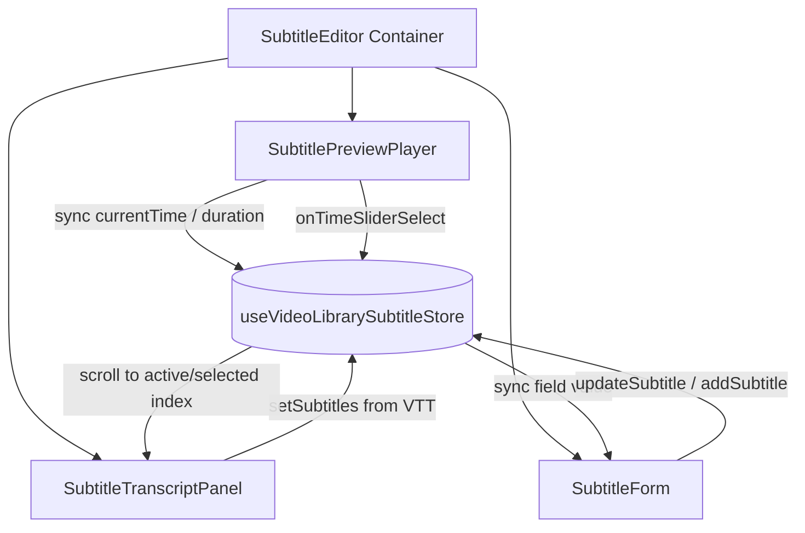
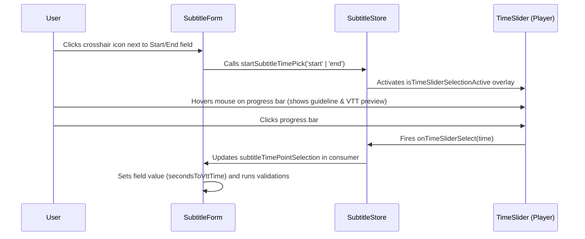

# Subtitle Editor Flow & Architecture

The Subtitle Editor is a highly interactive, custom-built component for editing and synchronization of video subtitles within the MovieHub CMS. It combines a dynamic video player with a synchronized, virtualized transcript list and a time-point selection tool.

---

## 1. High-Level Architecture

The Subtitle Editor is structured into four main components coordinated via a centralized state store:

- **Container (`SubtitleEditor`)**: Co-ordinates overall layout and dynamic panel height calculation.
- **State Store (`useVideoLibrarySubtitleStore`)**: Holds the reactive state for the current video time, subtitles array, active/selected segment cues, form edits, and timeline point selection states.
- **Player (`SubtitlePreviewPlayer`)**: Renders the `@vidstack/react` video player. Provides real-time playback time updates, timeline markers, and intercepts seek-clicks to capture precise timestamps.
- **Form (`SubtitleForm`)**: Form fields for editing start/end timestamps and cue text, complete with overlap and duration validations.
- **Transcript Panel (`SubtitleTranscriptPanel`)**: Renders a virtualized cue list (`SubtitleList`) using `@tanstack/react-virtual`. Fetches and parses VTT files and handles auto-scrolling during playback.

---

## 2. Component Layout & Responsibilities

### SubtitleEditor ([subtitle-editor.tsx](../src/app/video-library/[id]/subtitle/[subtitleId]/_components/subtitle-editor.tsx))

- Sets up a split page structure:
  - **Left Area (9/12 width)**: Renders the video player stacked on top of the editing form.
  - **Right Area (3/12 width)**: Renders the transcript panel.
- Uses a custom hook `useElementHeight` to dynamically track the height of the left player + form and passes the combined height to the transcript panel to ensure perfect scrolling.

### SubtitlePreviewPlayer ([subtitle-preview-player.tsx](../src/app/video-library/[id]/subtitle/[subtitleId]/_components/subtitle-preview-player.tsx))

- Dynamically imports the `VideoPlayer` component (SSR disabled for browser compatibility).
- Maps the loaded subtitles array into player markers: `{ id, start, end }`.
- Updates the store's current playback time via `onTimeSliderSelect` and `onTimeUpdate`.
- Renders the active subtitle text overlay.

### SubtitleForm ([subtitle-form.tsx](../src/app/video-library/[id]/subtitle/[subtitleId]/_components/subtitle-form.tsx))

- Built on `BaseForm` (React Hook Form + Zod resolver with `subtitleSchema`).
- Handles creating/updating subtitles locally in the store.
- Enforces validation rules:
  1. **Order Check**: Start time must be less than end time.
  2. **Boundary Check**: Timestamps must be within the video's total duration.
  3. **Overlap Check**: Cues must not overlap other existing subtitle cues.

### SubtitleTranscriptPanel ([subtitle-transcript-panel.tsx](../src/app/video-library/[id]/subtitle/[subtitleId]/_components/subtitle-transcript-panel.tsx))

- Fetches the raw VTT file from S3/MinIO, parses it into cue objects using `parseVttContent`, and hydrates the store.
- Uses virtualization to handle large transcript files efficiently without DOM performance lag.
- Synchronizes with playback time:
  - Auto-scrolls the active cue into the center of the list.
  - Limits smooth scroll behavior to adjacent items (index distance $\le 8$) to avoid jarring visual jumps; instantly snaps (`behavior: 'auto'`) for seeks beyond 8 segments.
  - Pauses auto-scrolling if the user has focus on any input/textarea inside the panel.

---

## 3. Interactive Data Flows

### A. Auto-Scrolling & Highlighting during Playback

1. The video plays $\rightarrow$ `<VideoPlayer>` fires `onTimeUpdate`.
2. `SubtitlePreviewPlayer` calls `setCurrentTime(currentTime)`.
3. `SubtitleTranscriptPanel` detects the time change and computes the active/nearest index.
4. If not currently typing in a form field, `rowVirtualizer.scrollToIndex(activeIndex)` is called.
5. In `SubtitleList`, any segment containing `currentTime` receives the `isActive` highlights class.

### B. Segment Selection & Seeking

1. The user clicks on a subtitle card in the list $\rightarrow$ triggers `onSelect(subtitle.id)`.
2. `setSelectedSubtitleId` updates the store.
3. `SubtitlePreviewPlayer` detects `selectedSubtitleId`, sets `playerRef.current.currentTime = subtitle.startTime`, and pauses the player to allow editing.

### C. Timeline Time-Point Picker Flow

The editor features a custom timeline point picker that allows users to capture precise timestamps straight from the video progress bar:

1. **Activate Picker**: Inside `SubtitleForm`, clicking the target crosshair button next to "Thời gian bắt đầu" (start) or "Thời gian kết thúc" (end) calls `startSubtitleTimePick(field)`.
2. **Slider Overlay Interception**:
   - The player's timeline slider ([time-slider.tsx](../src/components/video-player/_components/time-slider.tsx)) detects `isTimeSliderSelectionActive = true`.
   - It overlays a transparent, full-width pointer interceptor button (`z-30 cursor-crosshair`).
   - Standard seek behavior is blocked (`event.preventDefault()`).
3. **Guideline & Preview**:
   - As the user moves their pointer over the progress bar, `getSelectionHoverPreview` calculates the exact percentage and time code from the horizontal cursor coordinates.
   - A vertical preview guideline is drawn, and a hover tooltip showing the formatted VTT time code (e.g. `00:05:12.300`) follows the pointer.
4. **Time Capture**:
   - Clicking on the progress bar triggers `onTimeSliderSelect?.(hoverPreview.time)`.
   - This dispatches `selectSubtitleTimePoint(seconds)` to the store.
5. **Form Hydration**:
   - The `SubtitleTimePointSelectionConsumer` inside `SubtitleForm` receives the change.
   - It formats the captured seconds into VTT string format (`secondsToVttTime`) and fills the corresponding `start` or `end` input field.
   - It validates constraints and updates the form state (making it dirty).
