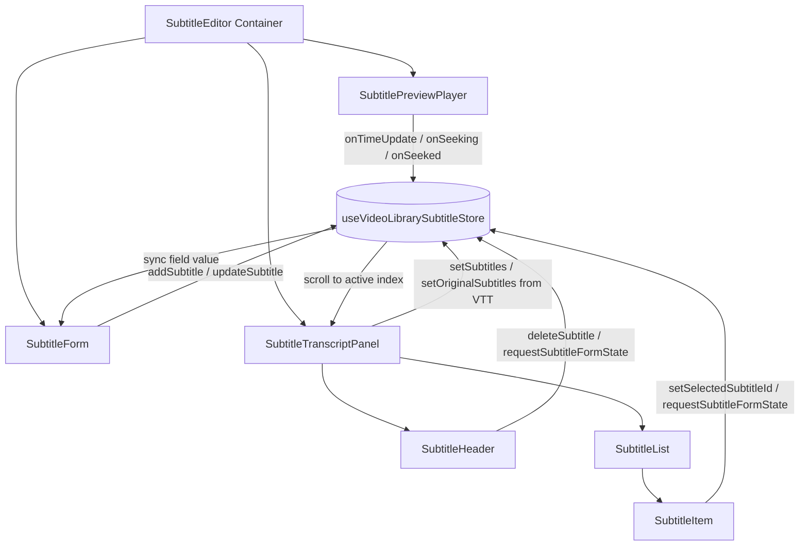
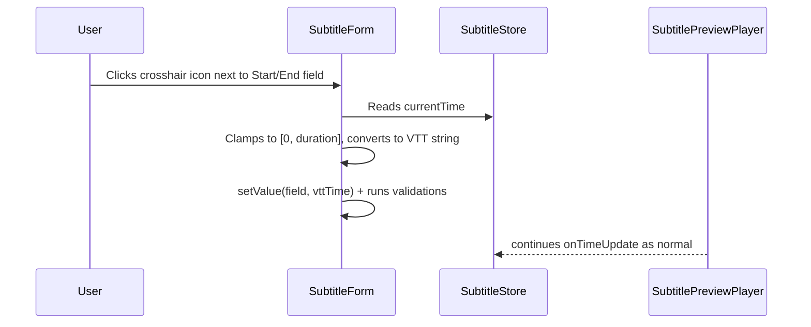

# Subtitle Editor Flow & Architecture

The Subtitle Editor is a highly interactive, custom-built component for editing and synchronization of video subtitles within the MovieHub CMS. It combines a dynamic video player with a synchronized, virtualized transcript list and an inline editing form.

---

## 1. High-Level Architecture

The Subtitle Editor is structured into five main components coordinated via a centralized state store:

- **Container (`SubtitleEditor`)**: Co-ordinates overall layout and dynamic panel height calculation. Also fetches the sibling subtitle list to resolve the subtitle label for the breadcrumb.
- **State Store (`useVideoLibrarySubtitleStore`)**: Holds the reactive state for current video time, subtitles array, seeking state, active/selected cues, form state, and the dirty-guard confirm modal.
- **Player (`SubtitlePreviewPlayer`)**: Renders the `@vidstack/react` video player via dynamic import (SSR disabled). Tracks playback time, manages seek state (`startSeek` / `completeSeek`), and overlays active subtitle text.
- **Form (`SubtitleForm`)**: Inline form for editing start/end timestamps and cue text. Activated by `subtitleFormState` in the store. The crosshair button captures the current playback position directly into the field.
- **Transcript Panel (`SubtitleTranscriptPanel`)**: Fetches and parses the VTT file, hosts the virtualizer, and manages auto-scroll. Renders `SubtitleHeader` and `SubtitleList`.

---

## 2. Component Layout & Responsibilities

### SubtitleEditor ([subtitle-editor.tsx](../src/app/video-library/[id]/subtitle/[subtitleId]/_components/subtitle-editor.tsx))

- Sets up a split page structure:
  - **Left Area (9/12 width)**: Video player stacked on top of the editing form.
  - **Right Area (3/12 width)**: Transcript panel.
- Uses `useElementHeight` twice (once for the player, once for the form wrapper) to sum both heights and pass the combined value to the transcript panel for perfect alignment.
- Fetches the sibling subtitle list via `useListBase` to resolve the subtitle's display label for the breadcrumb.
- Syncs `videoLibrary.hostname` into the store via `setVideoLibraryHostname` (used by `SubtitleHeader` when uploading).
- Renders a global `ConfirmModal` driven by `isSubtitleFormSwitchConfirmOpen` to guard unsaved form edits when the user tries to switch to another cue.

### SubtitlePreviewPlayer ([subtitle-preview-player.tsx](../src/app/video-library/[id]/subtitle/[subtitleId]/_components/subtitle-preview-player.tsx))

- Dynamically imports `VideoPlayer` (SSR disabled).
- Maps the subtitles array to player markers: `{ id, start, end }`.
- The active marker is whichever cue is `selectedSubtitle ?? activeSubtitle`.
- Handles seek lifecycle: `onSeeking` → `startSeek()`; `onSeeked` → `completeSeek(currentTime)`. The transcript panel suppresses auto-scroll while `isSeeking` is true.
- When `selectedSubtitleId` changes, seeks the player to `selectedSubtitle.startTime` and pauses it.
- Overlays the preview subtitle text absolutely at the bottom of the video.

### SubtitleForm ([subtitle-form.tsx](../src/app/video-library/[id]/subtitle/[subtitleId]/_components/subtitle-form.tsx))

- Rendered always but visually disabled (opacity + `pointer-events-none`) when no `subtitleFormState` is active.
- Built on `BaseForm` (React Hook Form + Zod resolver with `subtitleSchema`).
- `subtitleFormState` in the store drives the mode (`create` | `edit`) and which subtitle is loaded.
- The crosshair **"Áp dụng thời gian hiện tại"** button calls `applyCurrentTime(field, form)` which reads `currentTime` from the store, clamps it to `[0, duration]`, converts to VTT string, and sets the field value with validation.
- On submit, validates ordering, boundary, and overlap constraints before calling `addSubtitle` or `updateSubtitle` in the store.
- On close, if `isSubtitleFormChanged` is true, shows an inline `ConfirmModal`; otherwise closes immediately.
- Scrolls itself into view (smooth) when a subtitle is selected for editing.

### SubtitleTranscriptPanel ([subtitle-transcript-panel.tsx](../src/app/video-library/[id]/subtitle/[subtitleId]/_components/subtitle-transcript-panel.tsx))

- Fetches the raw VTT file from S3/MinIO with `cache: 'no-store'`, parses it with `parseVttContent`, and hydrates both `subtitles` and `originalSubtitles` in the store.
- Syncs `videoLibrary.duration` into the store via `useLayoutEffect`.
- Uses `useVirtualizer` (`@tanstack/react-virtual`) with `estimateSize: 150` and `overscan: 10`.
- Auto-scroll logic:
  - Skipped when `isSeeking` is true or `subtitleFormState` is active or user focus is on an input/textarea inside the panel.
  - Finds the active cue index; falls back to `getNearestSubtitleIndex` when no cue contains `currentTime`.
  - Smooth scroll for index distances ≤ 8; instant (`'auto'`) for larger jumps.
- Shows a seeking overlay (blur backdrop + spinner) when `isSeeking && !isLoading`.
- Renders `SubtitleHeader` (toolbar) and `SubtitleList` (virtualized cue list), or a not-found state when empty.

### SubtitleHeader ([subtitle-header.tsx](../src/app/video-library/[id]/subtitle/[subtitleId]/_components/subtitle-header.tsx))

- Toolbar at the top of the transcript panel.
- Displays segment count badge.
- **Add** button: calls `requestSubtitleFormState({ mode: 'create' })`.
- **Save** button (permission-gated via `useValidatePermission`): serializes current subtitles to VTT with `serializeVttContent` and uploads to S3/MinIO via `useUploadSubtitleMutation`. On success, syncs `originalSubtitles` to current subtitles to reset the dirty flag.
- **Download** button: exports the current subtitles as a `.vtt` file via a temporary `<a>` element.
- Save is disabled when content is unchanged (`serializeVttContent(subtitles) === serializeVttContent(originalSubtitles)`), when there are no valid cues, or during upload.

### SubtitleList ([subtitle-list.tsx](../src/app/video-library/[id]/subtitle/[subtitleId]/_components/subtitle-list.tsx))

- Receives `rowVirtualizer` and `virtualItems` from the panel.
- Reads `currentTime`, `selectedSubtitleId`, `subtitles`, and action dispatchers from the store.
- Computes `isActive` and `isSelected` per row and delegates to `SubtitleItem`.
- Handles list height using the last virtual item's `end` to avoid bottom-gap flicker.

### SubtitleItem ([subtitle-item.tsx](../src/app/video-library/[id]/subtitle/[subtitleId]/_components/subtitle-item.tsx))

- Renders a single cue card with `framer-motion` hover lift (`translateY: -2`).
- Highlights with a blue ring when `isActive` or `isSelected`.
- **Select** (card click / Enter / Space): calls `onSelect(id, virtualIndex)` → `setSelectedSubtitleId` + scroll to center.
- **Edit** button: calls `onSelect` (if not already selected) then `requestSubtitleFormState({ mode: 'edit', subtitleId })`.
- **Delete** button: wrapped in `ConfirmModal`, calls `deleteSubtitle(id)`.

---

## 3. State Store (`useVideoLibrarySubtitleStore`)

Located at [`src/store/video-library-subtitle.store.ts`](../src/store/video-library-subtitle.store.ts).

| State field                       | Type                                                                 | Purpose                                               |
| --------------------------------- | -------------------------------------------------------------------- | ----------------------------------------------------- |
| `currentTime`                     | `number`                                                             | Current video playback position in seconds            |
| `subtitles`                       | `SubtitleType[]`                                                     | Working copy of cues (sorted by startTime)            |
| `originalSubtitles`               | `SubtitleType[]`                                                     | VTT-fetched snapshot, used for dirty comparison       |
| `selectedSubtitleId`              | `string \| null`                                                     | ID of the cue the user clicked in the transcript      |
| `isSeeking`                       | `boolean`                                                            | True between `onSeeking` and `onSeeked` events        |
| `duration`                        | `number`                                                             | Total video duration in seconds                       |
| `subtitleFormState`               | `{ mode: 'create' } \| { mode: 'edit', subtitleId: string } \| null` | Controls form activation and mode                     |
| `pendingSubtitleFormState`        | same as above \| null                                                | Buffered next state while dirty-guard confirm is open |
| `isSubtitleFormChanged`           | `boolean`                                                            | True when form has unsaved edits                      |
| `isSubtitleFormSwitchConfirmOpen` | `boolean`                                                            | Controls the global switch-guard confirm modal        |
| `videoLibraryHostname`            | `string`                                                             | Hostname used for VTT upload URL construction         |

Key actions: `addSubtitle`, `updateSubtitle`, `deleteSubtitle` (all re-sort by `startTime`), `requestSubtitleFormState` (dirty-guard aware), `confirmSubtitleFormSwitch`, `startSeek` / `completeSeek`.

---

## 4. Interactive Data Flows

### A. Auto-Scrolling & Highlighting during Playback

1. Video plays → `<VideoPlayer>` fires `onTimeUpdate`.
2. `SubtitlePreviewPlayer` calls `setCurrentTime(currentTime)`.
3. `SubtitleTranscriptPanel` detects the time change and computes the active/nearest index.
4. If not seeking, not in form-edit mode, and no input is focused, `rowVirtualizer.scrollToIndex(activeIndex)` is called.
5. In `SubtitleList`, rows where `subtitle.startTime <= currentTime < subtitle.endTime` receive the `isActive` highlight.

### B. Segment Selection & Seeking

1. User clicks a subtitle card → `SubtitleItem` calls `onSelect(subtitle.id, virtualIndex)`.
2. `setSelectedSubtitleId` updates the store; the virtualizer scrolls the card to center.
3. `SubtitlePreviewPlayer` detects `selectedSubtitleId` change, seeks the player to `selectedSubtitle.startTime`, and pauses it.

### C. Current-Time Capture (Crosshair Button)

The crosshair button in `SubtitleForm` directly reads `currentTime` from the store and applies it to the focused timestamp field:

This is simpler than the previous timeline-slider picker: no overlay or intercept mode is required. The user pauses the video at the desired frame, then clicks the crosshair to stamp the current time into the field.

### D. Unsaved-Edit Guard (Form Switch)

When `isSubtitleFormChanged` is true and the user tries to switch to a different subtitle (via `requestSubtitleFormState`):

1. The store buffers the incoming `subtitleFormState` in `pendingSubtitleFormState` and sets `isSubtitleFormSwitchConfirmOpen: true`.
2. The `ConfirmModal` in `SubtitleEditor` opens.
3. On confirm → `confirmSubtitleFormSwitch()` promotes the pending state and clears the dirty flag.
4. On cancel → `setSubtitleFormSwitchConfirmOpen(false)` discards the pending state.

### E. Save to S3/MinIO

1. `SubtitleHeader` serializes the working subtitles with `serializeVttContent` (produces a valid `.vtt` string).
2. Wraps it in a `File` object and calls `uploadSubtitleMutate({ file, videoId, videoLibraryHostname })`.
3. On success, `setOriginalSubtitles(subtitles)` resets the dirty baseline so the Save button disables again.
