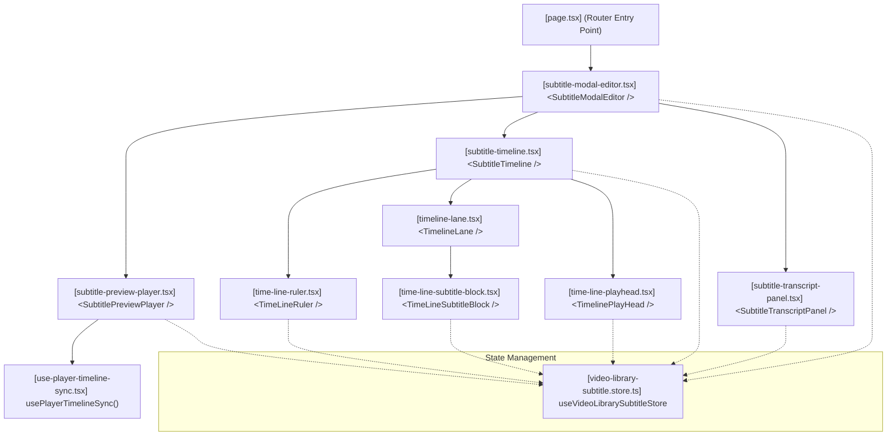

# Video Subtitle Timeline Editor Plan

## 1. Objective & Scope

Build a subtitle-focused React timeline editor inside MovieHub CMS allowing editors to edit, adjust timings, zoom, validate, and preview subtitles against HLS video playback.

- **In Scope:** Single-language cue workspace, zoom/pan ruler, drag-to-move and drag-to-resize cues, live `TextTrack` preview, transcript panel, validation, undo/redo, conflict-safe API save.
- **Out of Scope:** Video cutting/rendering, multi-lane audio mixing, client-side waveform generation (post-MVP).

---

## 2. Core Architecture Decisions

1. **Dedicated Workspace:** Opened in a dedicated editor workspace (`SubtitleModalEditor`) loaded on demand, keeping the main subtitle list page lightweight.
2. **Custom Canvas-less Timeline:** Render cues as absolute DOM elements mapped to timeline pixels. Use pointer capture/events for move/resize timing instead of heavy dnd libraries.
3. **State Boundaries:**
   - **Server State (TanStack Query):** Handles original cue document fetch and save mutation.
   - **Draft State (Zustand):** Handles editable cues list, active selection, undo/redo history, zoom level, and viewport scrolling.
   - **Transient State (Refs + DOM):** Playhead position and pointer drag coordinates bypass React state and are painted imperatively to ensure high-performance playback.
4. **Millisecond Base:** Store all timings in integer milliseconds (`startMs`, `endMs`) in the frontend and API; convert to seconds only at the player's `VTTCue` boundary.
5. **Long-file Performance:** Virtualize the transcript list (`@tanstack/react-virtual`) and render only cues intersecting the visible timeline viewport (computed via binary search).

---

## 3. WebVTT Client-side Parsing & Export

Since there are no custom database endpoints for individual subtitle cues, all operations are done in-memory on the client side using the raw WebVTT file format.

### WebVTT Parsing Logic

1. **Fetch:** Load the raw WebVTT file content from the subtitle's `fileUrl` using standard HTTP GET requests (e.g. `axios.get`).
2. **Regex Parsing:** Parse the WebVTT text file line-by-line:
   - Identify timestamps using regex matching `(\d{2}:)?\d{2}:\d{2}.\d{3} --> (\d{2}:)?\d{2}:\d{2}.\d{3}`.
   - Convert matching timestamps (hours, minutes, seconds, milliseconds) into standard numeric seconds (e.g., `12.345`) for timeline mapping.
   - Associate text blocks with parsed cues.

### WebVTT Serializer & Browser Export

1. **Compilation:** Convert the updated `SubtitleType[]` array from state back into standard WebVTT syntax:

   ```text
   WEBVTT

   00:00:12.345 --> 00:00:15.678
   Nội dung phụ đề 1

   00:00:17.100 --> 00:00:21.450
   Nội dung phụ đề 2
   ```

2. **Download Trigger:** Compile the WebVTT string into a browser `Blob`, generate an object URL, and trigger a download:
   ```typescript
   const blob = new Blob([vttString], { type: 'text/vtt;charset=utf-8' });
   const url = URL.createObjectURL(blob);
   const a = document.createElement('a');
   a.href = url;
   a.download = `${label || 'subtitle'}.vtt`;
   a.click();
   URL.revokeObjectURL(url);
   ```

---

## 4. Key Components & Responsibilities

| Component/Hook                 | File Path                                                                   | Responsibility                                                                                                         |
| ------------------------------ | --------------------------------------------------------------------------- | ---------------------------------------------------------------------------------------------------------------------- |
| `SubtitleModalEditor`          | `src/app/video-library/[id]/subtitle/_components/subtitle-modal-editor.tsx` | Editor workspace shell, handles loading state, parses VTT files, and handles the Save/Export buttons.                  |
| `SubtitlePreviewPlayer`        | `src/app/video-library/_components/subtitle-preview-player.tsx`             | Wraps Vidstack `<VideoPlayer>` and dynamically updates an in-memory `TextTrack` with draft cues using native `VTTCue`. |
| `SubtitleTimeline`             | `src/app/video-library/_components/subtitle-timeline.tsx`                   | Viewport container, manages zoom levels and horizontal scrolling canvas.                                               |
| `TimeLineRuler`                | `src/app/video-library/_components/time-line-ruler.tsx`                     | Renders time graduation ticks and captures click/drag seeks.                                                           |
| `TimelineLane`                 | `src/app/video-library/_components/timeline-lane.tsx`                       | Renders visible `<TimeLineSubtitleBlock>` components matching the current viewport.                                    |
| `TimeLineSubtitleBlock`        | `src/app/video-library/_components/time-line-subtitle-block.tsx`            | Handles pointer drag handlers for moving (body drag) and resizing (edge drag).                                         |
| `TimelinePlayHead`             | `src/app/video-library/_components/time-line-playhead.tsx`                  | Frame-synchronized vertical line representing the current time (painted imperatively).                                 |
| `SubtitleTranscriptPanel`      | `src/app/video-library/_components/subtitle-transcript-panel.tsx`           | Virtualized list displaying searchable textareas for all cues.                                                         |
| `usePlayerTimelineSync`        | `src/app/video-library/_hooks/use-player-timeline-sync.tsx`                 | Synchronizes playhead using `requestVideoFrameCallback` when playing.                                                  |
| `useVideoLibrarySubtitleStore` | `src/store/video-library-subtitle.store.ts`                                 | Zustand store holding active `currentTime` and `subtitles` array.                                                      |

### Component Dependency Tree



---

## 5. Timeline Math & Interaction

### Conversion Formulas

- **Time to Position:** $x = timeInSeconds * pixelsPerSecond$
- **Position to Time:** $timeInSeconds = \text{round}((x / pixelsPerSecond) * 1000) / 1000$ (rounded to millisecond precision)

### Clamping & Drag rules

- **Move:** Preserves cue duration; clamps within `[0, duration]`.
- **Left Resize:** Clamps to `[0, end - MIN_DURATION_SEC]` (where `MIN_DURATION_SEC` = 0.1).
- **Right Resize:** Clamps to `[start + MIN_DURATION_SEC, duration]`.
- **Snapping:** Snaps drag times within a $0.08\text{s}$ (80ms) threshold to the playhead, adjacent cue borders, or a grid interval (default $0.1\text{s}$).

---

## 6. Implementation Checklist

### Phase 0 — Existing Baseline & Player Hooking (Completed)

- [ ] Integrate Vidstack `<VideoPlayer>` with dynamic HLS and VTT track overlays
- [ ] Setup baseline `useVideoEditorStore` holding `currentTime` and `subtitles`
- [ ] Hook player track load events to parse active subtitle cues into state

### Phase 1 — Setup & VTT Loading

- [ ] Implement client-side WebVTT file fetcher and parser helper functions
- [ ] Setup Zustand `video-library-subtitle.store` for in-memory cue draft state
- [ ] Build editor workspace component (`SubtitleModalEditor`) with open/close triggers
- [ ] Add unsaved changes confirmation modal guard

### Phase 2 — Timeline Viewport & Zoom

- [ ] Build Math helper functions
- [ ] Implement scrollable `TimelineViewport` & ResizeObserver width listener
- [ ] Render timeline graduation ruler, snap settings, and zoom (in, out, fit)
- [ ] Implement imperative `TimelinePlayhead` synced via `requestVideoFrameCallback`

### Phase 3 — Editing & Live Preview

- [ ] Add cue move and resize handlers via pointer event capture
- [ ] Implement undo/redo command stack
- [ ] Create `SubtitlePreviewPlayer` updating dynamic Vidstack preview track via native `VTTCue`
- [ ] Add basic cue split, delete, add actions, and continuous validation

### Phase 4 — Export & Virtualization

- [ ] Build WebVTT compiler and wire "Export VTT" button to trigger file download
- [ ] Integrate `@tanstack/react-virtual` for the transcript pane
- [ ] Add binary-search filtering to timeline lane rendering for long-sub optimization

### Phase 5 — Enhancements

- [ ] Add cue merge, batch time shifting, text find & replace, and loop selection.
